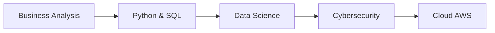

# 🚀 Aldo Bernardi - Data Science & Cybersecurity Portfolio

## 🌐 Live Portfolio
**[https://aldber.github.io/DataScience-Portfolio/](https://aldber.github.io/DataScience-Portfolio/)**

## 📊 Projetos em Destaque

| Projeto | Descrição | Tecnologias | Demo |
|---------|-----------|-------------|------|
| 🏠 [Real Estate Analytics](projects/01-real-estate-sp) | Dashboard de preços de imóveis | Streamlit, GeoPandas | [Live Demo](https://01-sp-housing-aldber.streamlit.app/) |
| 💰 [SQL Analytics](projects/02-sql-analytics) | Queries avançadas e otimização | PostgreSQL, Python | [Código](projects/02-sql-analytics) |
| 📊 [Sales Dashboard](projects/03-sales-dashboard) | Dashboard interativo de vendas | Dash, Plotly, Bootstrap | [Preview](projects/03-sales-dashboard) |
| 🔐 [CyberFinance Guardian](projects/04-cyber-finance-guardian) | Cybersecurity + Finanças (Em breve) | Python, Security | 🚧 |
| ☁️ [AWS Security Labs](projects/05-aws-security-labs) | Laboratórios de cloud security (Em breve) | AWS, Security | 🚧 |

## 🛠️ Tech Stack

### 📊 Data Science & Analytics
- **Python** (Pandas, NumPy, Scikit-learn)
- **SQL** (PostgreSQL, Query Optimization)
- **Visualização** (Plotly, Dash, Streamlit)

### ☁️ Cloud & DevOps
- **AWS** (EC2, S3, Lambda, Cloud Practitioner)
- **Docker** (Containerização)
- **Git/GitHub** (CI/CD, Versionamento)

### 🔐 Cybersecurity  
- **Network Security** (CCNA1 em andamento)
- **Security Analytics**
- **Compliance & Privacy**

## 📈 Business Impact

| Projeto | Impacto | Métricas |
|---------|---------|----------|
| Real Estate | +15% precisão em precificação | ML models, geospatial analysis |
| SQL Optimization | -60% tempo de execução | Query tuning, indexes |
| Sales Dashboard | 5+ visualizações interativas | Real-time KPIs, filtering |

## 🎓 Learning Journey

## 📫 Contact

- 📧 Email: [aldo.bernardi@gmail.com](mailto:aldo.bernardi@gmail.com)
- 💼 LinkedIn: [Aldo Bernardi](https://linkedin.com/in/aldo-bernardi)
- 🔗 GitHub: [@AldBer](https://github.com/AldBer)
- 🏆 Credly: [Badges](https://credly.com/users/aldo-bernardi.5b9ee3e3/badges)

## 📄 License

MIT License - Veja [LICENSE](LICENSE) para detalhes.