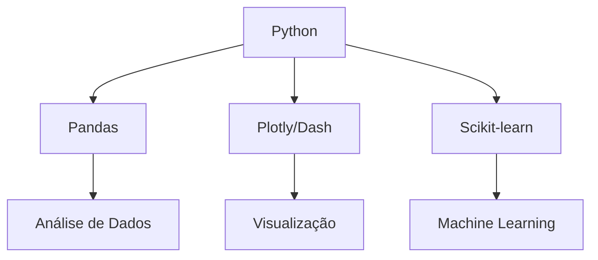

# Portfólio de Data Science

[](https://aldber.github.io/DataScience-Portfolio/)
[](https://git-lfs.com)

Repositório documentando minha evolução em Python, análise de dados e machine learning.

## 🚀 Projetos Destacados

### 1. Análise de Mercado Imobiliário (SP)
- **Técnicas usadas**:
  - Geoprocessamento com GeoPandas
  - Visualização com Plotly
  - Dashboard interativo com Dash
- [Acesse o projeto](01_SP_Housing/)

### 2. Análise Criptomoedas
- **Recursos**:
  - Web scraping de exchanges
  - Análise técnica automatizada
  - Bot de notícias via Telegram
- [Explore aqui](02_Crypto_Analysis/)

## 📈 Stack Tecnológica



## 🛠️ Como Executar

```bash
# Clone com Git LFS
git lfs install
git clone https://github.com/AldBer/DataScience-Portfolio.git

# Instale dependências
pip install -r requirements.txt

# Execute o dashboard
python dashboards/app.py
```

## 🌱 Aprendizados Recentes
| Data       | Tópico               | Progresso |
|------------|----------------------|-----------|
| 2025-08-03 | Integração Dash-LFS  | ✅        |
| 2025-08-02 | GitHub Actions       | ⚙️       |
| 2025-08-01 | Agents com LangChain | 📚        |

## 🤝 Contribuições
Sugestões são bem-vindas! Abra uma issue ou:
```python
print("Envie um PR! 🚀")
```

> "Dados são a nova matéria-prima do século XXI" - Adaptado de Tim Berners-Lee
