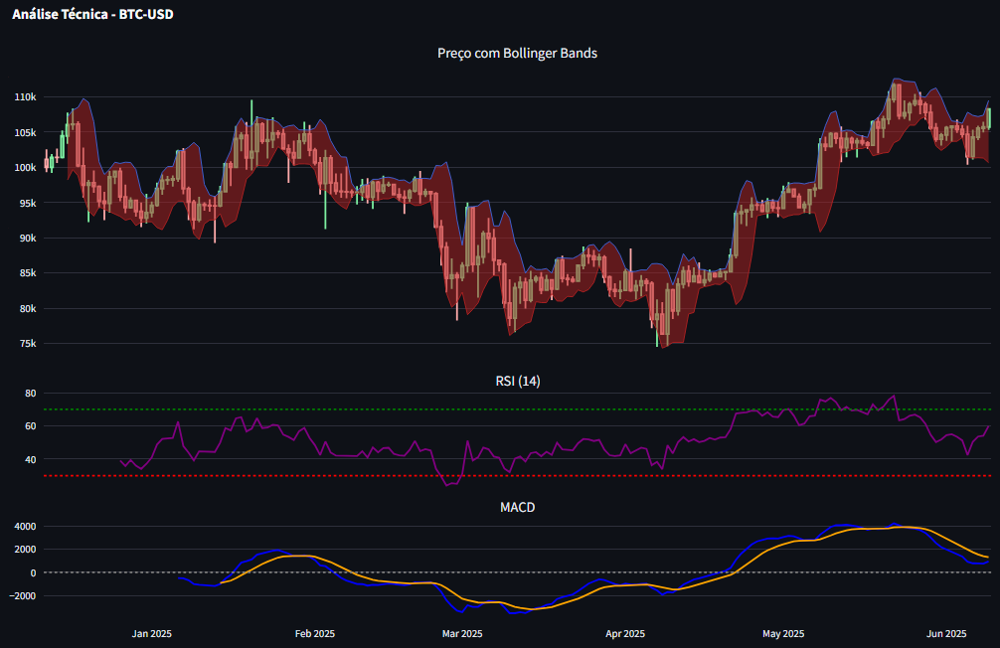

<link rel="icon" href="{{ '/_includes/favicon.ico' | relative_url }}">
<link rel="stylesheet" href="https://cdnjs.cloudflare.com/ajax/libs/font-awesome/6.4.0/css/all.min.css">

<style>
  :root {
    --bg-dark: #121212;
    --card-dark: #1e1e1e;
    --text-primary: #e0e0e0;
    --text-secondary: #a0a0a0;
    --accent: #6c63ff;
    --hover: #7d75ff;
  }
  
  body {
    background-color: var(--bg-dark);
    color: var(--text-primary);
    font-family: 'Segoe UI', Tahoma, Geneva, Verdana, sans-serif;
  }
  
  .project-card {
    background-color: var(--card-dark);
    border-radius: 12px;
    padding: 25px;
    margin-bottom: 40px;
    box-shadow: 0 8px 16px rgba(0,0,0,0.3);
    transition: all 0.3s ease;
    border-left: 4px solid var(--accent);
  }
  
  .project-card:hover {
    transform: translateY(-5px);
    box-shadow: 0 12px 24px rgba(0,0,0,0.4);
    border-left: 4px solid var(--hover);
  }
  
  .btn-accent {
    background-color: var(--accent);
    color: white;
    padding: 10px 20px;
    border-radius: 6px;
    text-decoration: none;
    display: inline-block;
    margin: 8px 8px 8px 0;
    transition: all 0.2s ease;
    font-weight: 500;
  }
  
  .btn-accent:hover {
    background-color: var(--hover);
    transform: scale(1.05);
  }
  
  h1, h2, h3 {
    color: var(--text-primary);
  }
  
  .skills-grid {
    display: grid;
    grid-template-columns: repeat(auto-fit, minmax(200px, 1fr));
    gap: 20px;
    margin: 30px 0;
  }
  
  .skill-card {
    background-color: var(--card-dark);
    padding: 20px;
    border-radius: 8px;
    border-top: 3px solid var(--accent);
  }
</style>

# Portfólio de Ciência de Dados <br> <span style="color: var(--accent)">Aldo Bernardi</span>

## 🚀 Projetos em Destaque

---

### 1. Dashboard Imobiliário 3D - California (Nova Versão)
[](01_California_Housing/assets/3d_imoveis_dark.html)

**Tecnologias:** Python, Plotly, GeoPandas  
**Recursos:**  
- Visualização noturna com filtros dinâmicos  
- Análise de tendências temporais  
- Integração com dados do Zillow API  

[📁 Código Fonte](https://github.com/aldber/DataScience-Portfolio/tree/main/01_California_Housing){: .btn .btn-accent }  
[📊 Dashboard](01_California_Housing/assets/3d_imoveis_dark.html){: .btn .btn-accent }

---

## 2. Análise de Criptoativos

[](https://yourusername-streamlit-app.streamlit.app/)

**Atualização Automática:**
- Dados renovados diariamente via GitHub Actions
- Indicadores calculados em tempo real

[📊 Acesse o Dashboard](https://yourusername-streamlit-app.streamlit.app/){: .btn .btn-accent }
[🔄 Código de Atualização](.github/workflows/update_crypto.yaml){: .btn .btn-accent }

👨‍💻 Perfil Técnico
<div class="skills-grid"> <div class="skill-card"> <h4><i class="fas fa-database"></i> Engenharia de Dados</h4> <ul> <li>Pipelines com Airflow</li> <li>APIs REST/GraphQL</li> <li>Spark para Big Data</li> </ul> </div> <div class="skill-card"> <h4><i class="fas fa-chart-line"></i> Análise</h4> <ul> <li>Séries Temporais</li> <li>Geoespacial (Kepler.gl)</li> <li>Visualização Interativa</li> </ul> </div> <div class="skill-card"> <h4><i class="fas fa-robot"></i> Machine Learning</h4> <ul> <li>XGBoost/LightGBM</li> <li>Redes Neurais</li> <li>AutoML (PyCaret)</li> </ul> </div> </div>

📬 Contato Profissional


<div style="margin-top:30px"> <a href="https://linkedin.com/in/aldo-bernardi/" target="_blank" class="btn-accent"> <i class="fab fa-linkedin"></i> LinkedIn </a> <a href="https://github.com/aldber" target="_blank" class="btn-accent"> <i class="fab fa-github"></i> GitHub </a> <a href="https://kaggle.com/aldobernardi" target="_blank" class="btn-accent"> <i class="fab fa-kaggle"></i> Kaggle </a> </div> ```