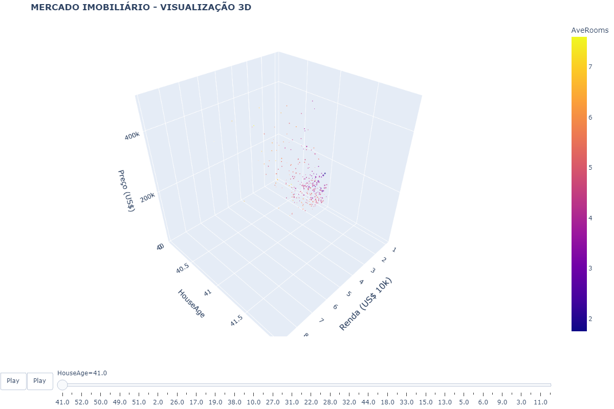

<link rel="icon" href="{{ '/_includes/favicon.ico' | relative_url }}">

# Portfólio Data Science - Aldo Bernardi

## 🚀 Projetos
---
### 1. Análise de Imóveis 3D

**Tecnologias:** Python, Plotly, Pandas  
**Destaques:**  
- Visualização interativa  
- Filtros por renda e localização  

- [📁 Código Fonte](https://github.com/aldber/DataScience-Portfolio/tree/main/notebooks)
- [📥 Download Dados California](01_California_Housing/data/california_housing.csv){: .btn .btn-purple }

### 2. Dashboard Criptomoedas

**Recursos:**
- Candle sticks em tempo real
- Indicadores técnicos

- [📁 Código Fonte](02_Crypto_Analysis/notebooks/crypto_analysis.ipynb)

### 3. Próximo Projeto (Em Breve!)
*Stay tuned!*

---
## 👨‍💻 Sobre o Autor
**Aldo Bernardi**  
Engenheiro de Produção
Cientista de Dados em formação
## Habilidades  
- <i class="fas fa-chart-line"></i> Análise de Dados  
- <i class="fas fa-robot"></i> Machine Learning  
**📩 Contato**



*Ou me encontre no* | [GitHub](https://github.com/aldber) | [Maven](https://mavenanalytics.io/profile/3831d340-70a1-70d5-9e73-7070b65b6224?view=projects) | [Microsoft](https://learn.microsoft.com/pt-br/users/aldobernardi-7398/)

